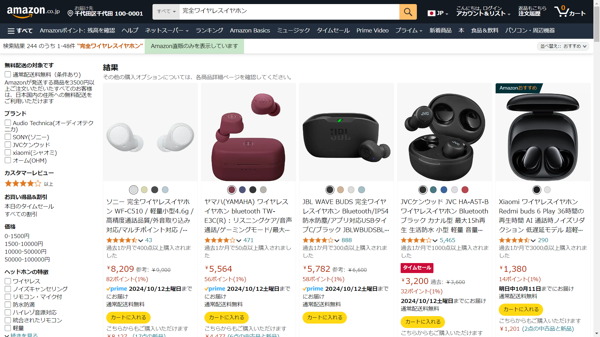

# 直zon - Chokuzon

## 直zonとは？

直zonは、通販サイト [Amazon.co.jp](https://amazon.co.jp) の商品検索ページにて、表示する商品を出荷元・販売元共にAmazon.co.jpのものだけに絞り込むことができるChrome拡張機能です。

## 使用イメージ

### Before...

### After!!!

## 直zonの仕組み

仕組みは単純で、一時期話題になったパラメーターである `?emi=AN1VRQENFRJN5` をURLの一番後ろ付与しているだけです。

毎回コピペすることもできますが手間だと思い簡単にできる「直zon」を開発しました。